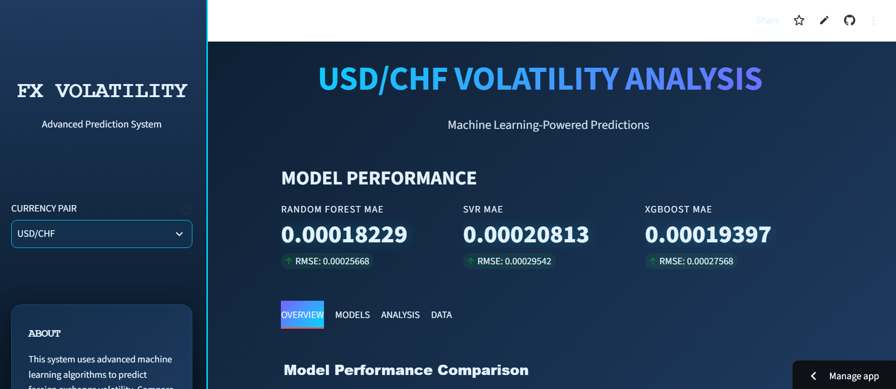
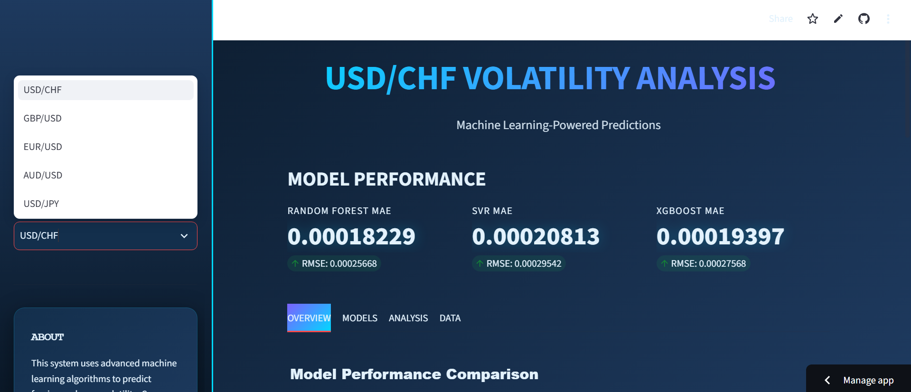
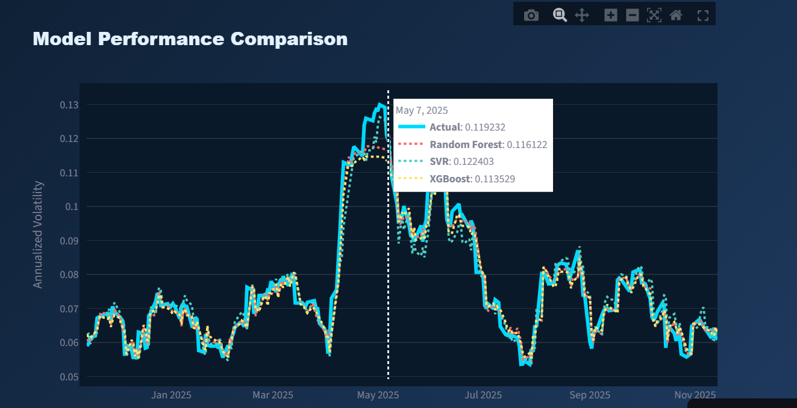
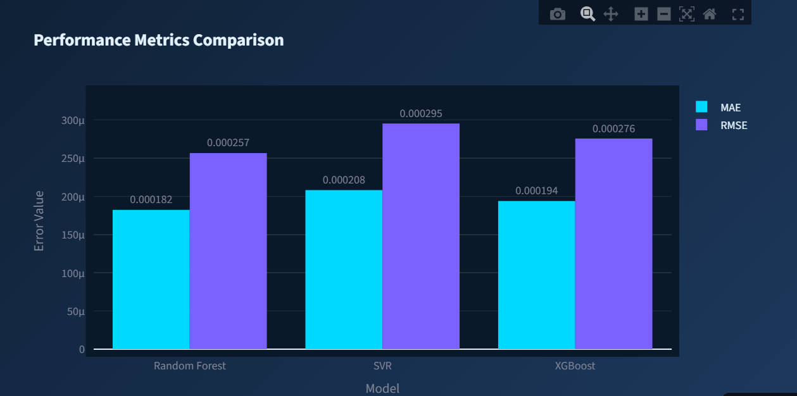
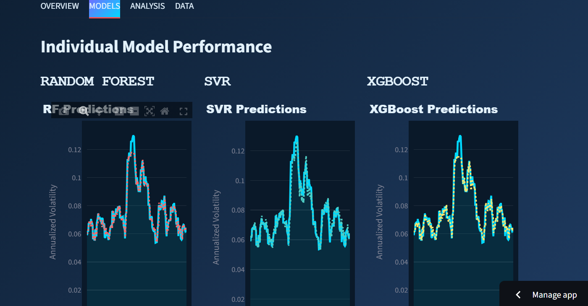

# FX Volatility Prediction Dashboard

An interactive **Streamlit** dashboard that predicts the **annualized volatility** of major foreign-exchange (FX) pairs with machine learning, and compares the performance of three models: **Random Forest**, **SVR** and **XGBoost**.

**Live demo:** _add your Streamlit app link here_

## Features

- Select a currency pair from the sidebar: **USD/CHF, GBP/USD, EUR/USD, AUD/USD, USD/JPY**
- Performance metrics (**MAE** and **RMSE**) for each model, shown as KPI cards
- Interactive **Plotly** charts (zoom, pan, hover tooltips, export as image)
- Four tabs:
  - **Overview**: model performance comparison, actual vs. predicted volatility, MAE/RMSE bar chart
  - **Models**: individual prediction plots for Random Forest, SVR and XGBoost
  - **Analysis**: further analysis of the results
  - **Data**: the underlying data
- Custom dark theme

## Models

| Model | Type |
|---|---|
| Random Forest | Ensemble of decision trees (bagging) |
| SVR | Support Vector Regression |
| XGBoost | Gradient-boosted trees |

The target variable is the **annualized volatility** of the selected pair. Models are compared on the same test period using MAE and RMSE (lower is better).

## Results (USD/CHF)

| Model | MAE | RMSE |
|---|---|---|
| **Random Forest** | **0.000182** | **0.000257** |
| XGBoost | 0.000194 | 0.000276 |
| SVR | 0.000208 | 0.000295 |

Random Forest gives the lowest error on USD/CHF, followed by XGBoost and SVR. All three models follow the volatility spike of spring 2025 closely, and SVR is the noisiest during the decline that follows.

## Screenshots

### Dashboard overview and model performance


### Currency pair selection


### Actual vs. predicted volatility


### MAE / RMSE comparison


### Individual model performance


## Project structure

```
ML_Dashboard/
├── .devcontainer/          # Dev container configuration
├── exchange_rate_results/  # Data and model results per currency pair
├── app_py.py               # Streamlit application
└── requirements.txt        # Python dependencies
```

## Getting started

```bash
# 1. Clone the repository
git clone https://github.com/Zeineb19/ML_Dashboard.git
cd ML_Dashboard

# 2. Install dependencies
pip install -r requirements.txt

# 3. Run the app
streamlit run app_py.py
```

The app opens at **http://localhost:8501**.

## Tech stack

Python · Streamlit · Plotly · scikit-learn · XGBoost · pandas · NumPy

## Possible improvements

- Add more models (GARCH, LSTM) as baselines
- Forecast future volatility, not only the test period
- Download predictions as CSV
- Hyperparameter tuning section

## Author

**Zeineb** · [GitHub](https://github.com/Zeineb19)
